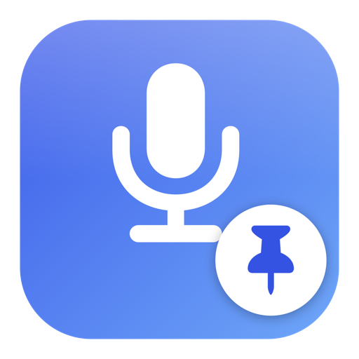

<p align="center">
  
</p>

<h1 align="center">MicPin</h1>

<p align="center">
  Keep macOS on the microphone you actually want — automatically.<br>
  <a href="README.zh-CN.md">简体中文</a>
</p>

---

macOS loves to fall back to the built-in microphone. Plug in a USB mic and it stays on the
MacBook mic; put on Bluetooth headphones and the input jumps to the headset mic — even when
you only wanted the headphones for listening.

**MicPin** is a tiny menu bar app that fixes this. Plug in a USB microphone and it becomes the
system input, instantly and every time. Anything that follows the system default input —
dictation, voice-input apps like Typeless, Zoom, Meet, Slack huddles — gets the right mic.

- **Zero configuration** — plug in a USB mic, it wins.
- **Bluetooth-proof** — wearing AirPods for audio never drags your input to the headset mic.
- **Pin a specific device** — two mics plugged in? Pick the one you want and it stays.
- **You can see it** — the menu bar shows the current mic; an optional HUD confirms every switch.
- **English and 简体中文**, following your system language.
- No microphone permission, no Accessibility permission, no network access. A few MB of RAM.

## The menu

| | |
|---|---|
| **Current input: NEOM USB** | plus a status line: what it's preferring, what it pinned, whether the pinned device is offline |
| **Which microphone to lock** | `Automatic (prefer USB mic)` plus every live input device, tagged USB / Built-in / Bluetooth. Click one to pin it; click again to go back to automatic |
| `Enable auto-lock` | turn it off when you deliberately want the built-in mic |
| `Show HUD when switching` | the top-right confirmation toast |
| `Show device name in menu bar` | icon only, or icon + name |
| `Launch at login` | |
| `Re-check now` | also pops the HUD, so you can confirm your mic before you start talking |

Menu bar icon: **filled mic** = locked on target · **outline mic** = enabled but no USB mic
present (system default left alone) · **crossed-out mic** = paused.

## Two modes

- **Automatic** — matches `preferred` name keywords in order, then falls back to any USB input
  device. Built-in, Bluetooth and virtual devices (Teams, Krisp, BlackHole …) are never picked.
- **Pinned** — you chose a specific device. If it isn't connected, MicPin does *not* substitute
  something else; it leaves the system default untouched.

## Install

Download `MicPin.app` from [Releases](../../releases), drag it to `/Applications`, open it.

It's not notarized, so the first launch needs one of:

```bash
xattr -dr com.apple.quarantine /Applications/MicPin.app
```

…or right-click the app → **Open** → **Open**.

### Build from source

Requires only Xcode command line tools — no dependencies, no package manager.

```bash
git clone https://github.com/bethlehem1989-tech/MicPin.git
cd MicPin && ./build.sh
cp -R build/MicPin.app /Applications/ && open -a /Applications/MicPin.app
```

## Configuration

Everything in the menu writes to `~/.config/micpin/config.json`. Editing the file by hand also
works — it is reloaded on every check.

| Key | Meaning |
|---|---|
| `enabled` | master switch |
| `mode` | `auto` or `pinned` |
| `pinnedUID` / `pinnedName` | the pinned device |
| `preferred` | ordered name keywords for automatic mode (substring, case-insensitive) |
| `blocked` | never select these (virtual audio devices) |
| `autoPickUSB` | fall back to any USB mic when no `preferred` entry is connected |
| `showHUD` | toast on switch |
| `showNameInMenuBar` | show the device name next to the icon |

Example — prefer a Shure, then a Yeti, then any USB mic:

```json
{
  "preferred": ["Shure", "Yeti"],
  "autoPickUSB": true
}
```

## How it works

A CoreAudio property listener on `kAudioHardwarePropertyDevices` and
`kAudioHardwarePropertyDefaultInputDevice`, plus a 3-second safety poll (Bluetooth HFP
transitions don't always fire a notification). When the chosen target isn't the current default,
MicPin writes `kAudioHardwarePropertyDefaultInputDevice`. That's the whole trick — it never opens
an audio stream, so macOS never asks for microphone permission.

Roughly 700 lines of Swift across six files, AppKit + CoreAudio only.

## License

MIT
